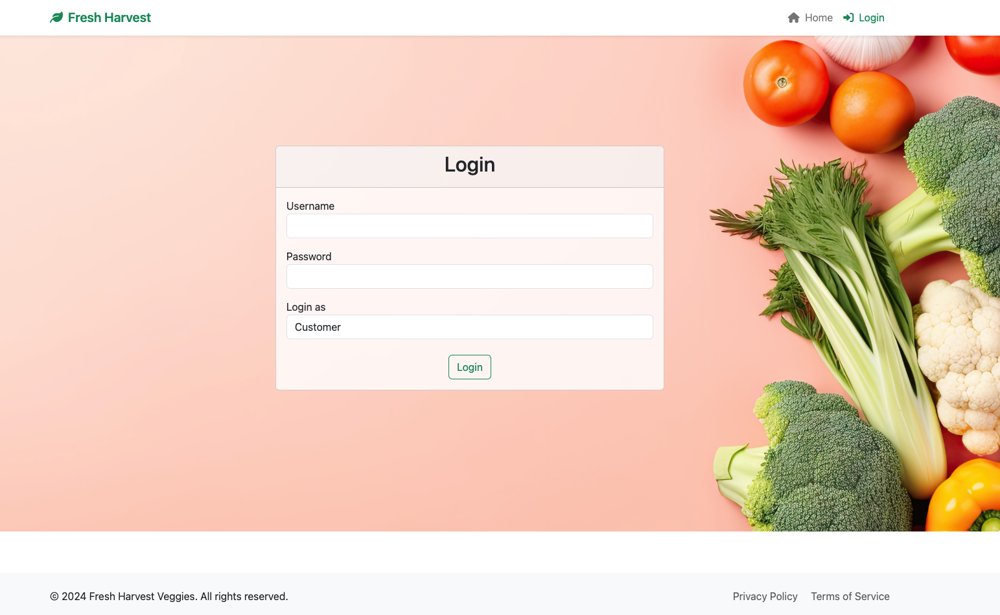

# The fastest way to checkout this project:

**Website address:**

[**https://jennyjc.pythonanywhere.com/**](https://jennyjc.pythonanywhere.com/)





# Optipn 1- Simply Browsing: 

**CLICK THE 'Home' ICON ON THE RIGHT TOP CORNER**

# Option 2-Explore more functions:
**Login in as different roles!**

**CUSTOMER:**

**username: test_customer**

**Password: customer123**


**SATFF:**

**username: test_admin**

**Password: admin123**



---

# Fresh Harvest Veggies - Online Order Management System

## Overview

Fresh Harvest Veggies is an online order management system designed for a farm-fresh vegetable business. The system caters to private and corporate customers, providing an efficient way to place orders for vegetables and premade boxes, manage customer accounts, and generate detailed sales and customer reports.

This project is implemented in Python using the Flask framework and SQLAlchemy for database interactions. It includes user authentication, order placement, and reporting functionalities, ensuring an intuitive and robust user experience.

---

## Features

### Customer Features
1. **User Authentication**: Customers can log in and out securely.
2. **Browse Products**:
   - Individual vegetables (by unit, weight, pack, etc.).
   - Premade boxes (customizable by size: Small, Medium, Large).
3. **Place Orders**:
   - Customize and order premade boxes.
   - Choose delivery or pickup options.
4. **Account Management**:
   - View and manage personal details.
   - Review current and past orders.
   - Cancel unprocessed orders.
5. **Flexible Payments**:
   - Pay using credit card, debit card, or account balance.
   - Corporate customers benefit from a 10% discount.

### Staff Features
1. **Order Fulfillment**:
   - View and process current and past orders.
   - Update order statuses.
2. **Product Management**:
   - View all products and their availability.
3. **Customer Insights**:
   - View customer details and order history.
4. **Reporting**:
   - Generate total sales reports (weekly, monthly, yearly).
   - Identify popular and unpopular items.

---

## System Requirements

- **Programming Language**: Python 3.9+
- **Framework**: Flask
- **Database**: MySQL
- **Python Libraries**:
  - SQLAlchemy
  - Flask-Login
  - PyMySQL
  - Flask-WTF
  - pytest (for testing)
  - Others (listed in `requirements.txt`)

---

## Installation Guide

### Step 1: Clone the Repository
```bash
git clone https://github.com/thoseJC/FHVeggies.git
cd FHVeggies
```

### Step 2: Set Up Virtual Environment
```bash
python3 -m venv .venv
source .venv/bin/activate
pip install -r requirements.txt
```

### Step 3: Configure the Database
1. Create a MySQL database on PythonAnywhere:
   - Database host: `JennyJC.mysql.pythonanywhere-services.com`
   - Username: `JennyJC`
   - Database name: `JennyJC$FHVeggies`

2. Update `config_settings.py` with your database credentials:
```python
SQLALCHEMY_DATABASE_URI = 'mysql+pymysql://<username>:<password>@<host>/<database>'
```

### Step 4: Initialize the Database
```bash
flask db upgrade
```

### Step 5: Run the Application
```bash
flask run
```

Access the app at `http://127.0.0.1:5000`.

---

## Project Structure

- **app/**: Contains all application modules:
  - **routes.py**: Application routes and logic.
  - **models.py**: SQLAlchemy database models.
  - **templates/**: HTML templates for the Flask app.
  - **static/**: Static assets like CSS, JS, and images.
- **migrations/**: Database migration files.
- **config_settings.py**: Application configuration.
- **requirements.txt**: Dependencies.

---

## Deployment on PythonAnywhere

1. Pull the latest changes from GitHub to PythonAnywhere:
   ```bash
   git pull origin main
   ```
2. Ensure dependencies are installed:
   ```bash
   pip install -r requirements.txt
   ```
3. Restart the PythonAnywhere web app.

---

## Testing

Run tests using `pytest`:
```bash
pytest
```

---

## Known Issues

- Ensure database credentials in `config_settings.py` are accurate.
- Customers and staff functionalities need further refinement for edge cases.

---

## Contributions

Contributions are welcome! Fork the repository and create a pull request with your improvements.

---

## License

This project is for educational purposes and follows the Lincoln University Academic Integrity Policy.

--- 

